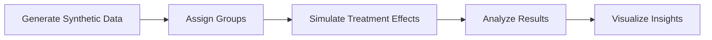

# BE-Project
# 🧪 Virtual Clinical Trial Simulator  
### Simulating Clinical Trials using Synthetic Patient Data

<p align="center">
  <b>Accelerate medical research with safe, scalable simulations</b><br>
  Reduce cost • Improve safety • Enable experimentation
</p>

---

## 🚀 Why This Project Matters
Traditional clinical trials are:
- Expensive 💰  
- Time-consuming ⏳  
- Ethically constrained ⚖️  

This project creates a **virtual simulation environment** using **synthetic patient data**, allowing researchers to test treatments without real-world risks.

---

## ✨ Key Features
- 🧬 Synthetic patient data generation  
- ⚖️ Control vs Treatment group simulation  
- 📊 Statistical analysis of outcomes  
- 📈 Data visualization (graphs & insights)  
- 🔁 Multiple scenario testing  

---

## 🧠 Tech Stack
| Category            | Tools Used |
|--------------------|----------|
| Language           | Python |
| Data Processing    | Pandas, NumPy |
| Visualization      | Matplotlib, Seaborn |
| Environment        | Jupyter Notebook |

---

## 🏗️ System Workflow



---

## 📊 Example Insights
- Treatment vs Control comparison  
- Recovery trends over time  
- Statistical effectiveness of treatment  

---

## ⚙️ Installation & Setup
```bash
# Clone repository
git clone https://github.com/your-username/virtual-clinical-trial.git

# Navigate to folder
cd backend

# Run backend
python app.py

# Open new terminal

# Navigate to folder
cd medical

# Run frontend
python manage.py runserver

# Click on http://127.0.0.1:8000
```

---

## 🧪 Sample Use Case
- Generate 1000 synthetic patients  
- Divide into control & treatment groups  
- Apply treatment simulation  
- Analyze and compare outcomes  

---

## ⚠️ Limitations
- Synthetic data may not fully reflect real-world complexity  
- Results depend on assumptions used in simulation  
- Not a replacement for real clinical trials  

---

## 🔮 Future Enhancements
- Cloud deployment (AWS / Azure)  
- Real-time IoT health data  
- Web-based dashboard  
